<p align="center">
  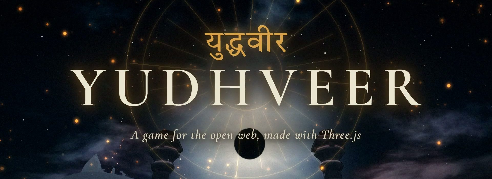
</p>

<p align="center">
  <b>An Indian mythological action game where the bosses block and parry back, built to run in a plain browser tab.</b>
</p>

<p align="center">
  <i>A game for the open web, made with Three.js</i>
</p>

<p align="center">
  <a href="https://yudhveer.pages.dev/"></a>
</p>

<p align="center">
  <a href="https://threejs.org/"></a>
  <a href="https://www.typescriptlang.org/"></a>
  <a href="https://vite.dev/"></a>
  <a href="https://rapier.rs/"></a>
  <a href="https://www.khronos.org/webgl/"></a>
  <a href="LICENSE"></a>
  
</p>

<p align="center">
  <a href="#about">About</a> &middot;
  <a href="#screenshots">Screenshots</a> &middot;
  <a href="#features">Features</a> &middot;
  <a href="#characters">Characters</a> &middot;
  <a href="#controls">Controls</a> &middot;
  <a href="#run-it-locally">Run it locally</a> &middot;
  <a href="#tech-stack">Tech stack</a> &middot;
  <a href="#project-structure">Project structure</a> &middot;
  <a href="#credits-and-licenses">Credits and licenses</a> &middot;
  <a href="#acknowledgements">Acknowledgements</a>
</p>

---

## About

**YUDHVEER** (युद्धवीर, "warrior-hero") is a sword-and-shield action game drawn from Indian myth: moonlit stepwells, forest akhadas, sea cities and snow peaks, fought through with a lathi, a talwar, a mace and a khanda. You play a young yodha who starts with almost nothing and earns every weapon, every guard and every trick on the road, across a prologue and five chapters. Each chapter is its own world, with its own light, its own music and its own bosses.

It is a game for the open web. There is no download, no install and no launcher: the campaign is a set of static files that the browser streams as each chapter loads, with [Three.js](https://threejs.org/) doing the drawing and [Rapier](https://rapier.rs/) the physics. The look is cel-shaded with ink lines, and the work went into how a fight *feels*: hit-stop on every blow, bodies that flinch, sparks where blades meet, and bosses that raise their weapons and turn your strikes aside.

> **Play it now at [yudhveer.pages.dev](https://yudhveer.pages.dev/)**: the whole campaign, free, in a desktop browser with WebGL 2. The first load streams about 29 MB. You can also [run it locally](#run-it-locally) in two commands. The story is deliberately not told here. Go and find it.

## Screenshots

Real gameplay, captured in the engine at 1080p. Nothing here gives the story away.

<table>
  <tr>
    <td width="50%" valign="top">
      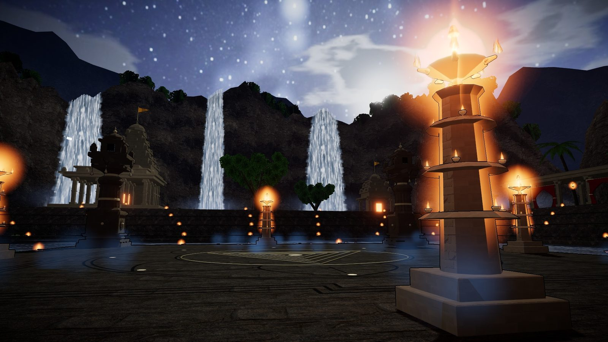<br>
      <sub><b>The Moonlit Baoli.</b> Lamp towers burn over a stepwell that keeps its own counsel.</sub>
    </td>
    <td width="50%" valign="top">
      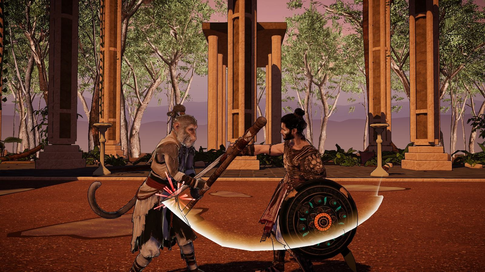<br>
      <sub><b>Hanuman Akhada.</b> An old vanara teaches with a staff. A shield is not for hiding.</sub>
    </td>
  </tr>
  <tr>
    <td width="50%" valign="top">
      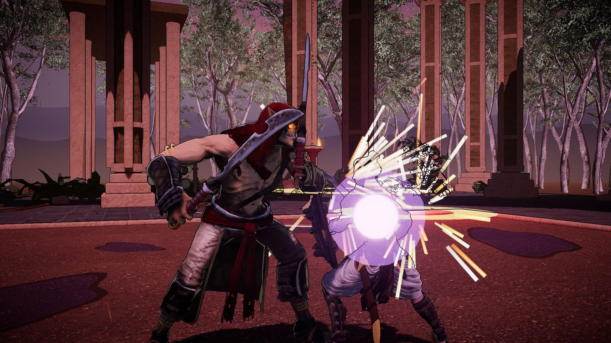<br>
      <sub><b>Turned aside.</b> Meet a sorcerer's bolt at the last moment and it flies back.</sub>
    </td>
    <td width="50%" valign="top">
      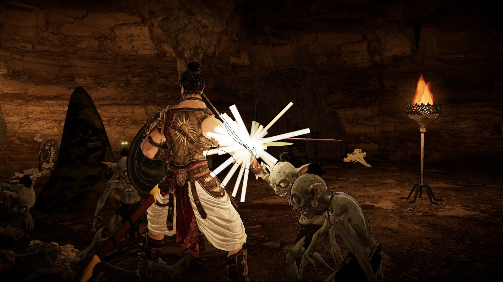<br>
      <sub><b>The Island.</b> Torchlight, old bones, and things that cling to the dark.</sub>
    </td>
  </tr>
  <tr>
    <td width="50%" valign="top">
      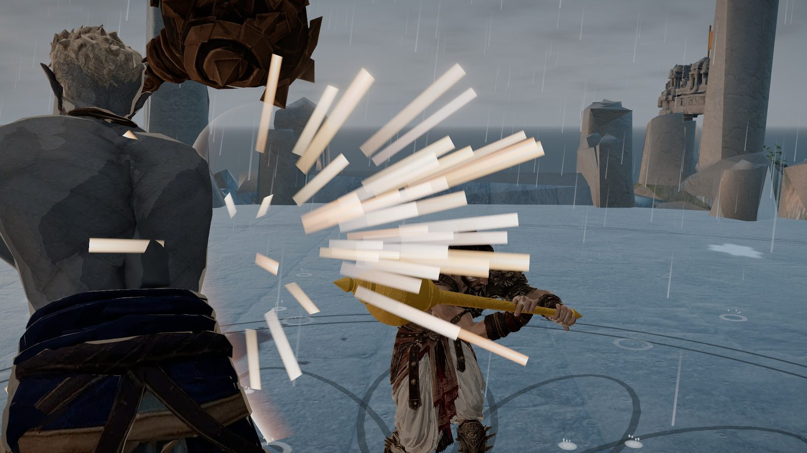<br>
      <sub><b>Dwarka in the rain.</b> Bosses raise their weapons and ring your blows aside.</sub>
    </td>
    <td width="50%" valign="top">
      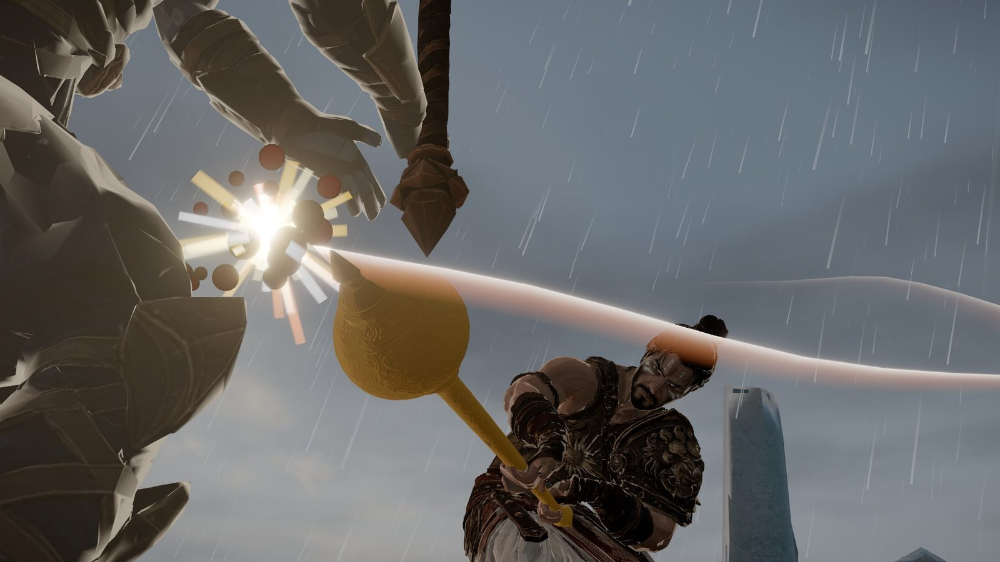<br>
      <sub><b>A charged blow</b>, from knee height.</sub>
    </td>
  </tr>
  <tr>
    <td width="50%" valign="top">
      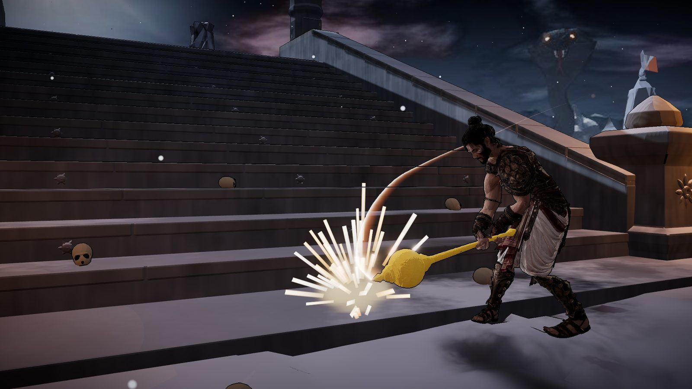<br>
      <sub><b>Kailasha Summit.</b> The mace comes down on cold stone.</sub>
    </td>
    <td width="50%" valign="top">
      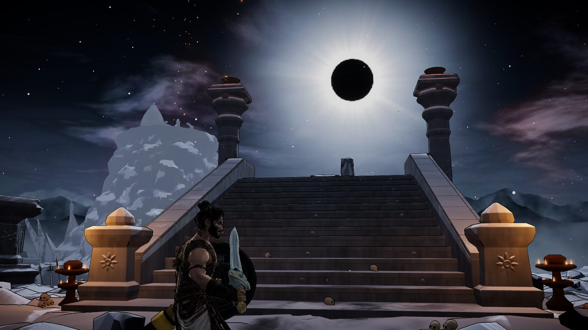<br>
      <sub><b>Under the eclipse.</b> The last stair is long.</sub>
    </td>
  </tr>
</table>

## Features

<p align="center">
  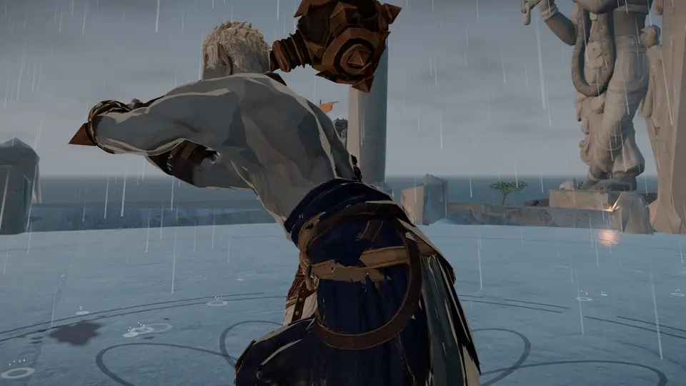<br>
  <sub>A mace clash in Dwarka, in slow motion. Captured live from the game.</sub>
</p>

- **Combat with weight.** Hit-stop on every blow, a flinch and a flash on whoever is struck, a camera that kicks with the hit, ribbon trails on the blades and *chingaari*: sparks thrown along the blade's path where steel meets steel. Swings turn toward the enemy you face and step in to reach it; a slide passes under blows and bolts; blows chain in threes and can be charged.
- **Deflect or be hit.** Meet a blow in the last 140 ms and the attacker is thrown off balance. Break its posture and it stays open: your blows land at 2.2 times the damage while it recovers.
- **Four weapons, earned on the road.** The lathi, the talwar with its dhal, the blessed mace in two hands, and the magical khanda. Each has its own set of moves; a move he has not earned yet simply does not work.
- **Five worlds, and a prologue.** A moonlit stepwell, a forest akhada that turns from sunset to night, lamp-lit caves, the rain-lashed sea city of Dwarka, and a snow summit under an eclipse. Every one has its own lighting, weather, music and ambience.
- **Bosses that block and parry.** A boss turns on you if you slide behind it, raises its weapon across its front to ring your blows aside, and answers with a backhand or a kick. It never guards mid-swing, so timing beats mashing.
- **Keyboard, mouse or gamepad.** Prompts follow whichever device you touched last, and a controller rumbles on impact. Pointer lock for the mouse, deadzones and walk-by-stick for the pad.
- **A story told in the engine.** Cutscenes, subtitles and recorded voices run on the same renderer as the fights, so there are no pre-rendered videos and no loading between a scene and a battle.
- **Runs in a tab.** Static files, no server code, no accounts, no cookies. Progress and settings live in the browser. The whole campaign is about 140 MB of models, sounds and skies, streamed as each chapter loads (the title screen needs about 29 MB).

### The road

| | Chapter | World | Faces | Carries |
|---|---|---|---|---|
| Prologue | The Last Lesson | A desert village at dusk | Raiders | The lathi |
| I | The Moonlit Baoli | A stepwell under the stars | The Baoli Guardian | The lathi |
| II | Hanuman Akhada | A forest training-ground, sunset into night | The old vanara, the Vetala, Mayavi | The talwar and the dhal |
| III | The Island | Lamp-lit sea caves | Cave runts and hurlers | The talwar and the dhal |
| IV | Dwarka | The sea city in rain and tide | Shalva, Takshaka | The blessed mace |
| V | Kailasha Summit | Snow and bridges under an eclipse | Rakshasas, yatudhanas, and one more | The khanda and the dhal |

<details>
<summary><b>How a fight works</b></summary>

- **Strike.** Press attack again to chain up to three blows. Once a blow's blade has passed, the next blow, a slide or a deflect cuts its follow-through short. Attack while sprinting for a leaping strike.
- **Slide.** Untouchable while low (about half a second), and it carries you past an enemy.
- **Guard and deflect.** Hold to guard. Press just as a blow lands (a 140 ms window) to deflect: the attacker is thrown off balance and its posture is damaged. A broken posture leaves it open.
- **Charge.** Stand still holding the charge button until your strength gathers; the next three blows strike harder, and a heavy blow breaks a boss's guard.
- **What he carries follows the chapter.** The kit per chapter is set in `src/game/Progression.ts`: the guard, the deflect, the charge and the leaping strike are each learned somewhere on the road.
- **Bosses.** They guard, turn, answer and kick, and every boss has a posture bar and health tuned against a playtest bot at three skill levels.

</details>

## Characters

Portraits of Yudhveer, the guru and the foot soldiers are the game's original 2D concept art. The others have no 2D concept art, so theirs are clean in-engine captures. The backstories stop where the game begins.

<table>
  <tr>
    <td width="220" valign="top">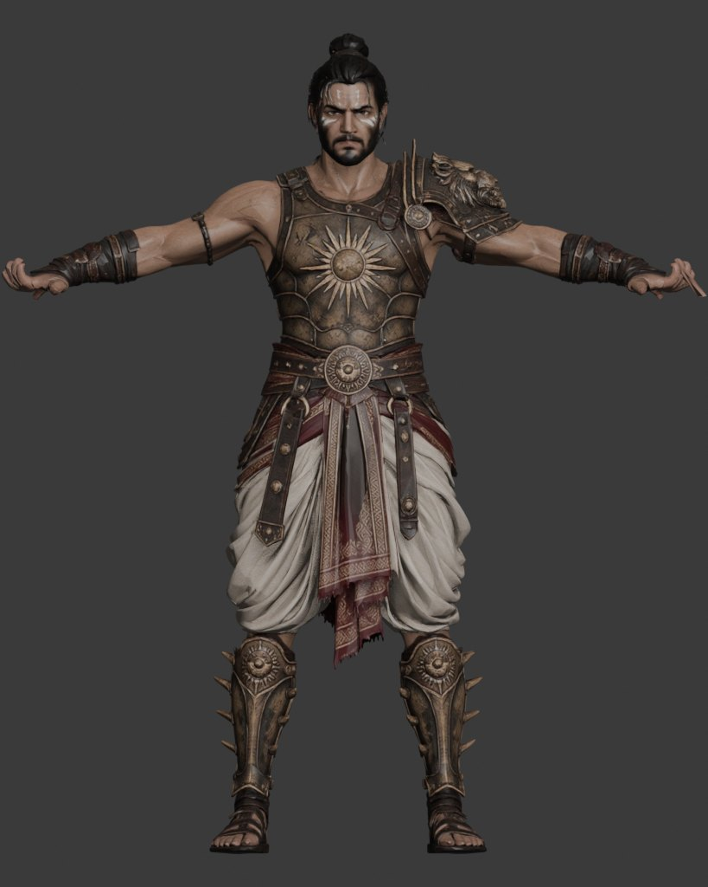</td>
    <td valign="top">
      <h3>Yudhveer</h3>
      <i>The hero. युद्धवीर, "warrior-hero".</i>
      <p>Yudhveer is a young yodha from a village at the edge of the desert, raised on dust, discipline and a teacher's patience. He begins with almost nothing: a lathi, feet that have learned to keep their footing, and a stubborn streak the desert gave him. He is not chosen and he is not strong yet; every weapon, every guard and every trick he will use is something he has to earn on the road. What he wants is simple, and the whole game is the cost of it: to leave the only home he has known and not turn back.</p>
    </td>
  </tr>
  <tr>
    <td width="220" valign="top">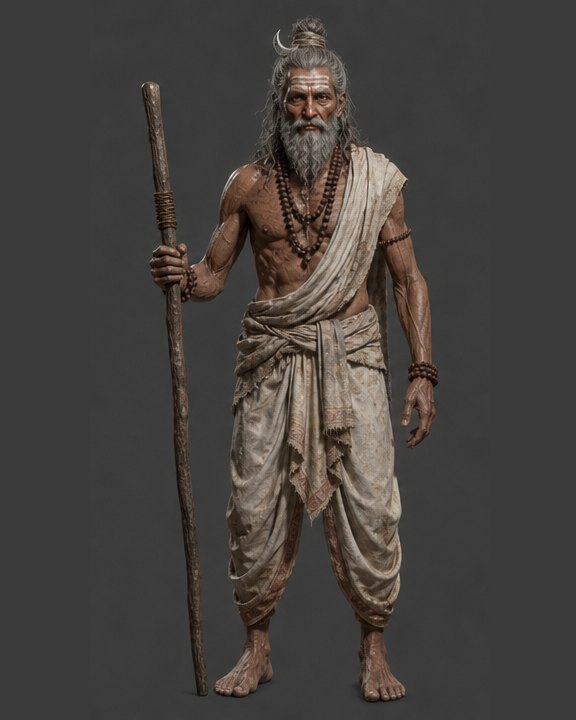</td>
    <td valign="top">
      <h3>The Guru</h3>
      <i>Guruji, Yudhveer's teacher.</i>
      <p>An old man who lives beside the village's little mandir, barefoot, with a tall staff and a string of prayer beads. He speaks little and repeats himself on purpose: feet first, then the lathi; keep your feet, whatever comes through that gate. He asks nothing of his students but attention and the willingness to do it again. His lessons are the first weapon Yudhveer ever owned, and they stay with the boy wherever he goes.</p>
    </td>
  </tr>
  <tr>
    <td width="220" valign="top">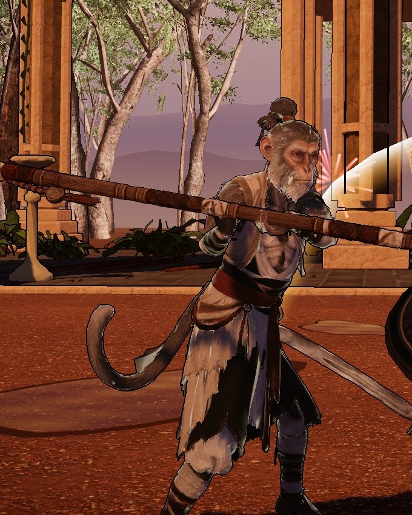</td>
    <td valign="top">
      <h3>The Vanara of the Akhada</h3>
      <i>An old monkey sage with a staff.</i>
      <p>The keeper of the Hanuman akhada, a forest training-ground older than anyone's memory of it. He is gruff, exact and unimpressed: he calls every newcomer "boy" and every wild swing "a farmer's". He fights with a long staff and hands out a dhal with a lecture, because a shield is not for hiding, it is for meeting the blow and turning it away. He will teach anyone who can stand up to the lesson, and he has no patience for anyone who cannot.</p>
    </td>
  </tr>
  <tr>
    <td width="220" valign="top">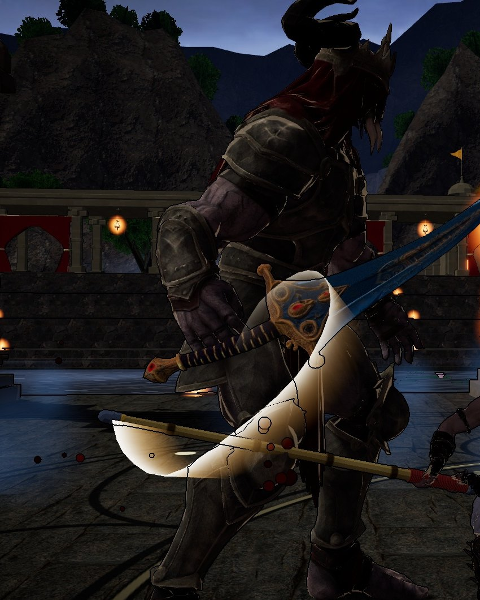</td>
    <td valign="top">
      <h3>The Baoli Guardian</h3>
      <i>Keeper of the stepwell.</i>
      <p>More than three metres of horned armour and a blue-bladed talwar. The Guardian watches the old baoli outside the village, where lamp towers burn over still water and the steps go down into the dark. Nobody who comes down them gets past him without a fight, and he has the weight and the patience to make good on it. He is the first real wall on Yudhveer's road.</p>
    </td>
  </tr>
  <tr>
    <td width="220" valign="top">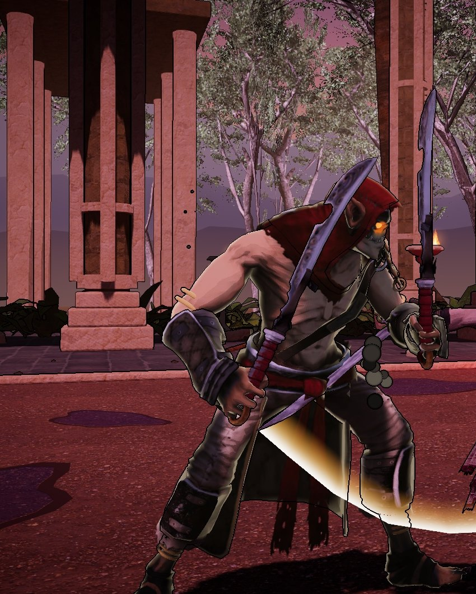</td>
    <td valign="top">
      <h3>The Vetala</h3>
      <i>A restless spirit with two blades.</i>
      <p>In the old tales a vetala is a restless spirit that haunts the places of the dead, and this one dresses for the part: a red hood, burning amber eyes and a pair of curved blades he handles like a dancer. He comes out of the dark when the akhada's lamps are lit, quick, patient and never tired. He fights alongside a sorcerer, and he guards as well as he strikes.</p>
    </td>
  </tr>
  <tr>
    <td width="220" valign="top">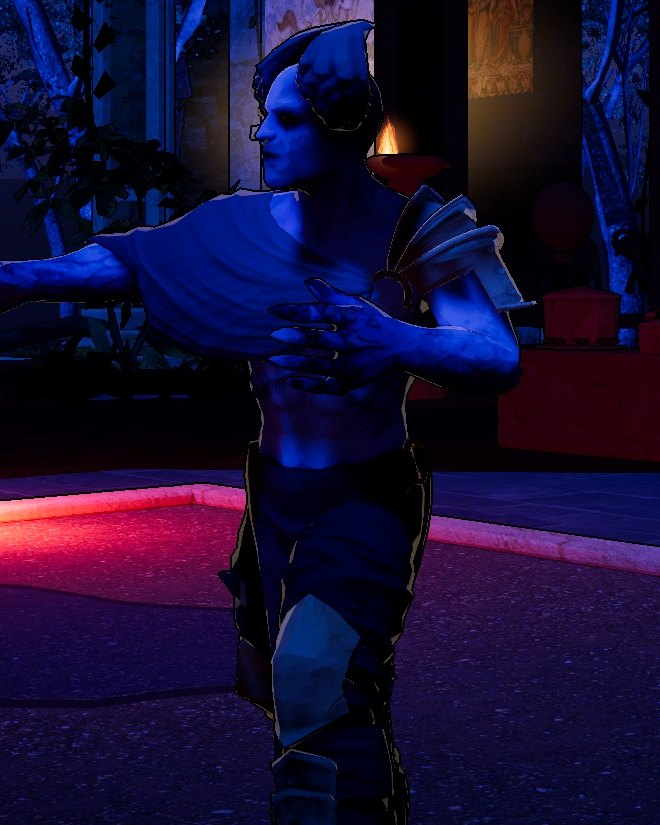</td>
    <td valign="top">
      <h3>Mayavi</h3>
      <i>Master of illusion.</i>
      <p><i>Maya</i> is illusion, and Mayavi is its master: a blue-skinned sorcerer who keeps his distance and lets the Vetala do the close work. He throws bolts of violet fire that burn whatever they touch. A clever student will learn that fire turns on a dhal like any blade, and that what he throws can be sent back to him.</p>
    </td>
  </tr>
  <tr>
    <td width="220" valign="top">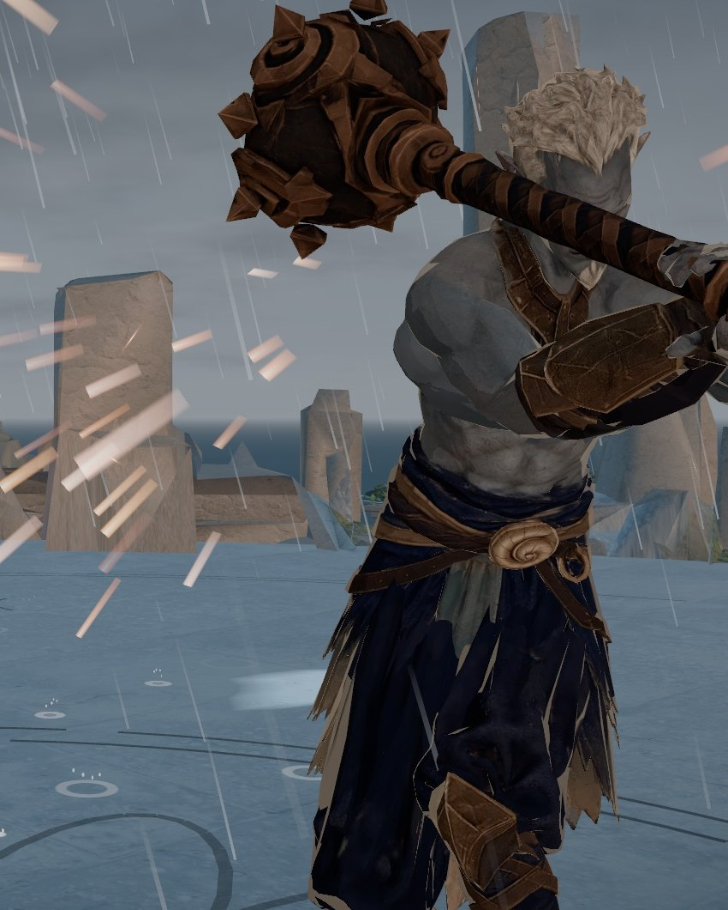</td>
    <td valign="top">
      <h3>Shalva</h3>
      <i>Raider of Dwarka.</i>
      <p>In the old tellings Shalva is the king who laid siege to the sea city. Here he is a pale, white-haired asura who has made Dwarka's storm-washed arena his own. He fights with a spiked gada that has broken better blades than any young warrior carries, leaps across the arena, and slips beneath the flooded flagstones to surface at your back. He is proud, patient, and certain that nothing on the shore can match his mace.</p>
    </td>
  </tr>
  <tr>
    <td width="220" valign="top">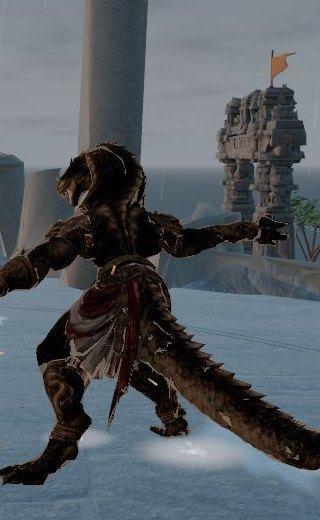</td>
    <td valign="top">
      <h3>Takshaka</h3>
      <i>King of the nagas.</i>
      <p>The serpent king of the sea around Dwarka: scaled, hooded, long-tailed, and older than the city's broken towers. He waits beneath the tide, slow to rise and terrible once he has, and breathes fire along the ground when his temper turns. Few go near the water he keeps.</p>
    </td>
  </tr>
  <tr>
    <td width="220" valign="top">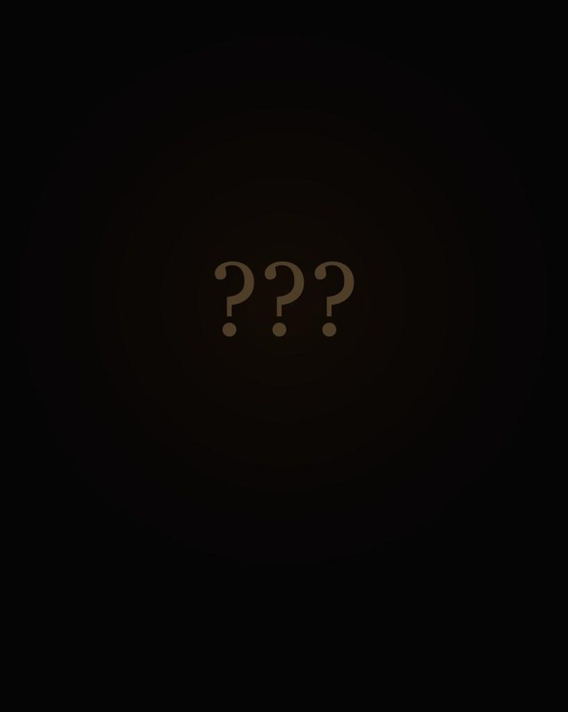</td>
    <td valign="top">
      <h3>???</h3>
      <i>Darkness has a name.</i>
    </td>
  </tr>
</table>

**The foot soldiers.** Most chapters send their own rank and file at you. Concept art for four of them:

<table>
  <tr>
    <td width="25%" align="center" valign="top">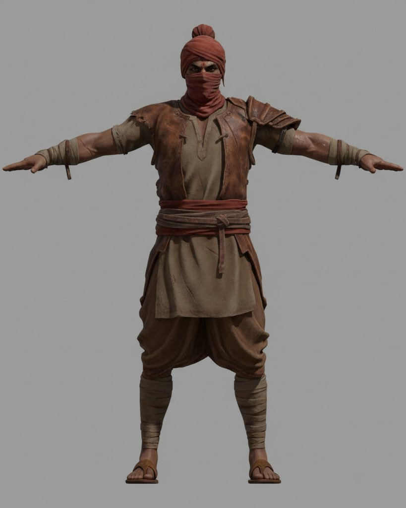<br><sub><b>Raiders</b><br>Desert dacoits in dust-brown cloth, a turban's tail across the face.</sub></td>
    <td width="25%" align="center" valign="top">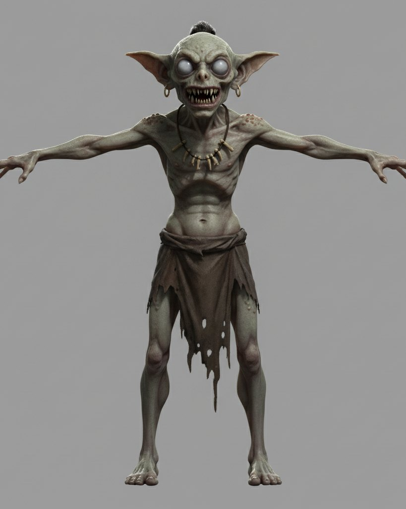<br><sub><b>Cave runts</b><br>Bat-eared and fast. They hunt in packs and circle to surround you.</sub></td>
    <td width="25%" align="center" valign="top">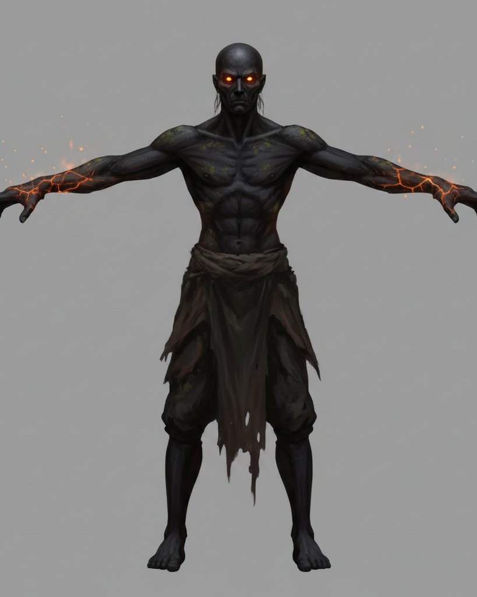<br><sub><b>Cave hurlers</b><br>Soot-black, ember-cracked. They keep their distance and hurl burning brands.</sub></td>
    <td width="25%" align="center" valign="top">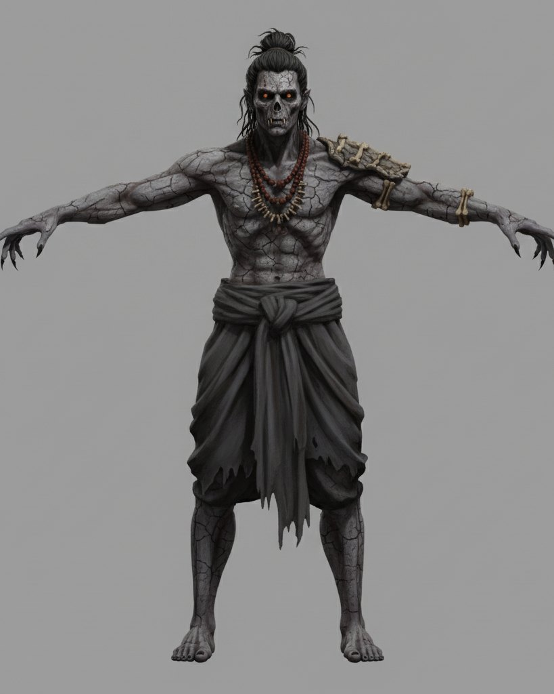<br><sub><b>Yatudhanas</b><br>Skull-faced demons of the high snow, in rosaries of teeth.</sub></td>
  </tr>
</table>

## Controls

Keyboard and mouse, or any standard gamepad. The on-screen prompts follow whichever you used last.

| Action | Keyboard and mouse | Gamepad |
|---|---|---|
| Move | <kbd>W</kbd> <kbd>A</kbd> <kbd>S</kbd> <kbd>D</kbd> or the arrow keys | Left stick |
| Look | Mouse | Right stick |
| Sprint | Hold <kbd>Shift</kbd> | Click the left stick (L3) |
| Walk | <kbd>C</kbd> to toggle | Push the stick lightly, or Back to toggle |
| Jump | <kbd>Space</kbd> | <kbd>A</kbd> |
| Attack (press again to chain three) | Left click | <kbd>X</kbd> or <kbd>RB</kbd> |
| Leaping strike | Attack while sprinting | Attack while sprinting |
| Slide (passes under blows and bolts) | <kbd>F</kbd> | <kbd>B</kbd> |
| Guard, and deflect with good timing | Right click | <kbd>LB</kbd> or <kbd>LT</kbd> |
| Charge the next three blows | Hold <kbd>Q</kbd> | Hold <kbd>Y</kbd> or <kbd>RT</kbd> |
| Sheathe or draw | <kbd>X</kbd> | D-pad down |
| Skip a cutscene | Hold <kbd>Space</kbd> or <kbd>Enter</kbd> | Hold <kbd>A</kbd> |
| Menus | Arrow keys or <kbd>W</kbd> <kbd>S</kbd>, <kbd>Enter</kbd>, <kbd>Esc</kbd> | D-pad or left stick, <kbd>A</kbd>, <kbd>B</kbd> |
| Pause | <kbd>Esc</kbd> | Start |

It needs a current desktop browser with WebGL 2. It is not built for phones or tablets.

## Run it locally

You need [Node.js](https://nodejs.org/) 22 or newer.

```bash
git clone https://github.com/TejasGov/Yudhveer.git
cd Yudhveer
npm install
npm run dev        # http://localhost:5199
```

| Script | What it does |
|---|---|
| `npm run dev` | Dev server on port 5199, with the debug tools on |
| `npm run build` | Checks asset URLs, type-checks, and builds to `dist/` |
| `npm run preview` | Serves the production build |
| `npm run build:pages` | The same build for a sub-path (GitHub Pages, `/Yudhveer/`) |
| `npm run build:itch` | A zip for itch.io with relative addresses: `yudhveer-itch.zip` |
| `npm run serve` | A small static server that mimics a host, for testing builds |
| `npm run pack:glb` | Losslessly repacks `.glb` models (smaller, same pixels) |

Hosting, base paths, download sizes and the test server are in [docs/DEPLOY.md](docs/DEPLOY.md). Every file the game asks for goes through `asset()` in `src/core/Assets.ts`; never write an `/assets/...` address in code (`npm run build` refuses it).

<details>
<summary><b>Developer tools (dev builds, or add <code>?debug</code> to the URL)</b></summary>

- **F3**: combat overlay (blades, hurt capsules, strike windows, the hit log).
- **Shift + 0 / 1 / 2 / 3 / 4 / 5**: jump straight into a chapter's fight (0 is the prologue).
- **Console**: `__debug.chapter(id, intro?)`, `__debug.shot(index, seconds)` to freeze a cutscene on a shot, `__debug.advance(seconds)`, `__debug.resume()`, `__debug.step(frames)` and `__debug.log()` for deterministic combat tests, and `__debug.win()` to win the fight at once. `__yudhveer` is the engine.
- **Balance and soak tools**: `await __debug.playtest(chapters, runs, { skill: 'novice' | 'steady' | 'expert', seed, tune })` has a bot play each chapter's fight on the fixed step (a seed replays the same fight) and reports win rate, time and damage. `__debug.playtestFlow()` plays the whole campaign with console errors hooked, `__debug.robustness()` runs the quit, retry, pause, frame-rate and resize checks, and `__debug.perf(chapter)` reports frame time, draw calls and triangles.

</details>

## Tech stack

| Layer | Choice |
|---|---|
| Rendering | [Three.js](https://threejs.org/) 0.186 on WebGL 2, with [postprocessing](https://github.com/pmndrs/postprocessing) for the ink outlines and screen effects |
| Look | Cel shading with a ramp, ink-line outlines, per-level lighting, a flame shader and a sky drawn in shaders |
| Physics | [Rapier](https://rapier.rs/) (`@dimforge/rapier3d-compat`), compiled to WebAssembly and bundled into the page |
| Simulation | A fixed 60 Hz simulation step with interpolated rendering |
| Language and build | TypeScript 7, [Vite](https://vite.dev/) 8 |
| Animation | glTF models with Mixamo-style rigs, retargeted and packed by Blender scripts; meshopt-compressed geometry and WebP textures |
| Audio | Recorded voices, effects and music, plus a small synthesizer for the rest, through the Web Audio API |
| Hosting | Static files only. The live build is on [Cloudflare Pages](https://yudhveer.pages.dev/) and redeploys from `main`; GitHub Pages, Netlify, Cloudflare Pages, itch.io or any web server also work |

## Project structure

```text
Yudhveer/
├── index.html              page markup
├── src/
│   ├── core/               engine loop, input, camera, physics world, settings, post-processing
│   ├── game/               chapters, the hero's kit per chapter (Progression), story scenes and lines
│   ├── cinematics/         camera director, chapter intros, the story-scene player
│   ├── combat/             hit detection, guard and parry, hit feel, particles, sound and voices
│   ├── entities/           the player, enemies, bosses, the animation rig, character definitions
│   ├── levels/             the six arenas, their lighting and effects
│   ├── ui/                 HUD, dialogue and subtitles, menus, glyphs, credits roll
│   └── debug/              playtest bot and probes (dev builds)
├── public/assets/          models, skies, music, voices and sound effects the game loads
├── scripts/                asset-URL check, GLB packer, itch.io zip, test server
├── docs/                   deploy notes, asset credits, design notes, README media
└── .github/workflows/      a manual GitHub Pages deploy
```

## Credits and licenses

### License

The **source code and the original project files** (the TypeScript, shaders, build scripts, documentation, and the game's own authored content) are released under the [MIT License](LICENSE), copyright (c) 2026 Tejas Govind (TejasGov).

**Third-party assets keep their own licenses.** The MIT license does not cover them and does not relicense them: the models, textures, sky, fonts and libraries listed below stay under the terms their authors chose, and those terms (including the attribution that CC BY asks for) apply if you reuse them. The screenshots and banner in `docs/media/` are captures of the game and include those assets.

The full record, with per-asset notes, is in [docs/ASSET_CREDITS.md](docs/ASSET_CREDITS.md); the in-game credits roll shows the same names. Each entry below follows the TASL pattern: **T**itle, **A**uthor, **S**ource, **L**icense, plus what was changed.

<details>
<summary><b>3D models: Sketchfab, CC BY 4.0 (21 models)</b></summary>

&nbsp;

Changes made to every model below: decimated to a game budget, rescaled and re-origined, textures resized and recoloured toward the level's palette (or replaced by a flat colour), metal, roughness and emission maps dropped, and the result merged into the level's `.glb`. Further changes are noted per model.

| Title | Author | Source | License | Modified |
|---|---|---|---|---|
| "Cave Rocks" | [Splanyic](https://sketchfab.com/splanyic) | [Sketchfab](https://sketchfab.com/3d-models/cave-rocks-4101c07c6a754f85962c6b516af4713a) | [CC BY 4.0](https://creativecommons.org/licenses/by/4.0/) | decimated, rescaled, retextured; split into separate pieces |
| "Rockwall" | [DJMaesen](https://sketchfab.com/bumstrum) | [Sketchfab](https://sketchfab.com/3d-models/rockwall-0740082617924a1b973201881594091a) | [CC BY 4.0](https://creativecommons.org/licenses/by/4.0/) | decimated, rescaled, retextured |
| "Stalagmites, Collums and Stalacites" | [RBG_illustrations](https://sketchfab.com/RBG_illustrations) | [Sketchfab](https://sketchfab.com/3d-models/stalagmites-collums-and-stalacites-3e06d8e13be64faf85d6ba6a1049b769) | [CC BY 4.0](https://creativecommons.org/licenses/by/4.0/) | decimated, rescaled, retextured; split into pieces, stretched per placement |
| "Stalagmite Formation 1" | [Kallvin](https://sketchfab.com/Kallvin) | [Sketchfab](https://sketchfab.com/3d-models/stalagmite-formation-1-da1f7a9e2fe04549a03d479d938b3088) | [CC BY 4.0](https://creativecommons.org/licenses/by/4.0/) | decimated, rescaled, retextured |
| "Stalagmite Formation 2" | [Kallvin](https://sketchfab.com/Kallvin) | [Sketchfab](https://sketchfab.com/3d-models/stalagmite-formation-2-736323ad07334c49be26da6f44f0c609) | [CC BY 4.0](https://creativecommons.org/licenses/by/4.0/) | decimated, rescaled, retextured |
| "Pile of Skulls" | [Abimael Gonzalez](https://sketchfab.com/abimaelgonzalez) | [Sketchfab](https://sketchfab.com/3d-models/pile-of-skulls-11d46d32494c44218a55192adc067e57) | [CC BY 4.0](https://creativecommons.org/licenses/by/4.0/) | decimated, rescaled, retextured |
| "Bone Pile" | [Kalciumm](https://sketchfab.com/Kalciumm) | [Sketchfab](https://sketchfab.com/3d-models/bone-pile-1b624083cb604782a0a0dfdb8d17a6c6) | [CC BY 4.0](https://creativecommons.org/licenses/by/4.0/) | decimated, rescaled, retextured; flat bone colour (the source has no texture) |
| "Buddhist Ceremonial Gateway (Torana)" | [EqualizerX](https://sketchfab.com/EqualizerX) | [Sketchfab](https://sketchfab.com/3d-models/buddhist-ceremonial-gateway-torana-1d3908a8b30a4932b5df17e1276e5f1a) | [CC BY 4.0](https://creativecommons.org/licenses/by/4.0/) | decimated, rescaled, retextured; darkened to weathered stone |
| "Low poly India Temple Wall" | [Mega 3D](https://sketchfab.com/3dlandscape) | [Sketchfab](https://sketchfab.com/3d-models/low-poly-india-temple-wall-e3604a8207d448338485fb164c8f30c1) | [CC BY 4.0](https://creativecommons.org/licenses/by/4.0/) | decimated, rescaled, retextured |
| "Kutthu Vilakku" | [nitheeshkumaarmv](https://sketchfab.com/nitheeshkumaarmv) | [Sketchfab](https://sketchfab.com/3d-models/kutthu-vilakku-aa1dd5a06d6f443ba9145e4183b2d7e7) | [CC BY 4.0](https://creativecommons.org/licenses/by/4.0/) | decimated, rescaled, retextured; recoloured as flat brass |
| "Brazier" | [mSameja](https://sketchfab.com/mSameja) | [Sketchfab](https://sketchfab.com/3d-models/brazier-653f30c424874a5a8ba4d71cef51d94e) | [CC BY 4.0](https://creativecommons.org/licenses/by/4.0/) | decimated, rescaled, retextured |
| "diwali diya" | [sinuboy072](https://sketchfab.com/sinuboy072) | [Sketchfab](https://sketchfab.com/3d-models/diwali-diya-627dea0363f042d3b0c906c90e922aec) | [CC BY 4.0](https://creativecommons.org/licenses/by/4.0/) | decimated, rescaled, retextured; its own flame removed, flat clay colours |
| "Medieval Wall Torch" | [Kigha](https://sketchfab.com/Kigha) | [Sketchfab](https://sketchfab.com/3d-models/medieval-wall-torch-77db436da2844cbfb4dde0bb9b396835) | [CC BY 4.0](https://creativecommons.org/licenses/by/4.0/) | decimated, rescaled, retextured |
| "Coiled Rope 2" | [TepidGames](https://sketchfab.com/TepidGames) | [Sketchfab](https://sketchfab.com/3d-models/coiled-rope-2-e6fe8fedd3d04b1dac3e32e0dd515cbb) | [CC BY 4.0](https://creativecommons.org/licenses/by/4.0/) | decimated, rescaled, retextured; flat rope colour |
| "Flat rocks" | [DJMaesen](https://sketchfab.com/bumstrum) | [Sketchfab](https://sketchfab.com/3d-models/flat-rocks-b76813cc177248418639026b06bc9745) | [CC BY 4.0](https://creativecommons.org/licenses/by/4.0/) | decimated, rescaled, retextured |
| "Rubble" | [Pert Doherty](https://sketchfab.com/pertdoherty) | [Sketchfab](https://sketchfab.com/3d-models/rubble-9a180893d6454f68a764e62be3fc5c92) | [CC BY 4.0](https://creativecommons.org/licenses/by/4.0/) | decimated, rescaled, retextured |
| "Hindu Temple Bell" | [Rushat Saiyush J Narayan](https://sketchfab.com/rushat_saiyush) | [Sketchfab](https://sketchfab.com/3d-models/hindu-temple-bell-fd30810e3fa84866b1b4f767c083ea6d) | [CC BY 4.0](https://creativecommons.org/licenses/by/4.0/) | decimated, rescaled, retextured; flat brass colour |
| "Assorted Old Pots" | [Kigha](https://sketchfab.com/Kigha) | [Sketchfab](https://sketchfab.com/3d-models/assorted-old-pots-7795c6a5fa144bfcb1c33041c71eab00) | [CC BY 4.0](https://creativecommons.org/licenses/by/4.0/) | decimated, rescaled, retextured; split into separate pots |
| "Indian Talwar Weapon (low poly)" | [Sangam Senapati](https://sketchfab.com/sangam04) | [Sketchfab](https://sketchfab.com/3d-models/indian-talwar-weapon-low-poly-9f17d36c21e5405baddf548dc2b66489) | [CC BY 4.0](https://creativecommons.org/licenses/by/4.0/) | decimated, rescaled, retextured; also re-origined at the grip and scaled to 0.95 m as the raiders' weapon |
| "Indian dhal (shield), 19th century" | [Pedram Ashoori](https://sketchfab.com/pedramashoori) | [Sketchfab](https://sketchfab.com/3d-models/indian-dhal-shield-19th-century-fca1088c468c480a845977189d66bf59) | [CC BY 4.0](https://creativecommons.org/licenses/by/4.0/) | decimated, rescaled, retextured |
| "Skeleton Sitting" | [Buzzie](https://sketchfab.com/Buzzie) | [Sketchfab](https://sketchfab.com/3d-models/skeleton-sitting-f06c95b499dd465aafe3338fe2b7a30e) | [CC BY 4.0](https://creativecommons.org/licenses/by/4.0/) | decimated, rescaled, retextured |

**One more model, CC0** (listed as a courtesy; no credit is owed):

| Title | Author | Source | License | Modified |
|---|---|---|---|---|
| "Ganesha, 10th - 11th C CE" | [Minneapolis Institute of Art](https://sketchfab.com/artsmia) | [Sketchfab](https://sketchfab.com/3d-models/ganesha-10th-11th-c-ce-375c670515684977b6ec05be115366ac) | [CC0 1.0](https://creativecommons.org/publicdomain/zero/1.0/) | decimated, rescaled, retextured |

</details>

<details>
<summary><b>Textures, a tree and a sky: Poly Haven, CC0</b></summary>

&nbsp;

[Poly Haven](https://polyhaven.com/) assets are CC0 and need no credit; they are listed as a courtesy, with the authors that the project's records name. Where an author is not recorded, the table says so. Changes: converted to the game's own materials (resized, desaturated or graded, softened for the cel shading, and in several levels multiplied by the level's vertex colours or baked into its albedo maps).

| Title | Author | Source | License | Used on |
|---|---|---|---|---|
| Cliff Side | James Ray Cock, Jenelle van Heerden, Dario Barresi | [Poly Haven](https://polyhaven.com/a/cliff_side) | [CC0 1.0](https://creativecommons.org/publicdomain/zero/1.0/) | the island's walls, Dwarka's coastal rock |
| Rocks Ground 02 | Rob Tuytel | [Poly Haven](https://polyhaven.com/a/rocks_ground_02) | [CC0 1.0](https://creativecommons.org/publicdomain/zero/1.0/) | the island's floor |
| Rock Boulder Dry | Dimitrios Savva, Rico Cilliers | [Poly Haven](https://polyhaven.com/a/rock_boulder_dry) | [CC0 1.0](https://creativecommons.org/publicdomain/zero/1.0/) | the island's shrine |
| Clay Plaster | Amal Kumar | [Poly Haven](https://polyhaven.com/a/clay_plaster) | [CC0 1.0](https://creativecommons.org/publicdomain/zero/1.0/) | the village's mud walls |
| Reed Roof 04 | Rob Tuytel | [Poly Haven](https://polyhaven.com/a/reed_roof_04) | [CC0 1.0](https://creativecommons.org/publicdomain/zero/1.0/) | the village's thatch |
| Dry Ground 01 | Rob Tuytel | [Poly Haven](https://polyhaven.com/a/dry_ground_01) | [CC0 1.0](https://creativecommons.org/publicdomain/zero/1.0/) | the village's earth |
| Aerial Sand | Rob Tuytel | [Poly Haven](https://polyhaven.com/a/aerial_sand) | [CC0 1.0](https://creativecommons.org/publicdomain/zero/1.0/) | the village's dunes |
| Red Sandstone Wall | Amal Kumar | [Poly Haven](https://polyhaven.com/a/red_sandstone_wall) | [CC0 1.0](https://creativecommons.org/publicdomain/zero/1.0/) | the village's gateway and well |
| Old Planks 02 | Rob Tuytel | [Poly Haven](https://polyhaven.com/a/old_planks_02) | [CC0 1.0](https://creativecommons.org/publicdomain/zero/1.0/) | the village's gate and cart |
| Bark Brown 02 | Rob Tuytel | [Poly Haven](https://polyhaven.com/a/bark_brown_02) | [CC0 1.0](https://creativecommons.org/publicdomain/zero/1.0/) | the village's and the baoli's trees |
| Mossy Rock | Rob Tuytel | [Poly Haven](https://polyhaven.com/a/mossy_rock) | [CC0 1.0](https://creativecommons.org/publicdomain/zero/1.0/) | moss and lichen in Dwarka |
| Sandstone Cracks | unknown, see docs/ASSET_CREDITS.md | [Poly Haven](https://polyhaven.com/a/sandstone_cracks) | [CC0 1.0](https://creativecommons.org/publicdomain/zero/1.0/) | Dwarka's rock and the akhada |
| Old Sandstone 02 | unknown, see docs/ASSET_CREDITS.md | [Poly Haven](https://polyhaven.com/a/old_sandstone_02) | [CC0 1.0](https://creativecommons.org/publicdomain/zero/1.0/) | Dwarka's ancient blockwork |
| Large Sandstone Blocks 01 | unknown, see docs/ASSET_CREDITS.md | [Poly Haven](https://polyhaven.com/a/large_sandstone_blocks_01) | [CC0 1.0](https://creativecommons.org/publicdomain/zero/1.0/) | Dwarka's paving |
| Tree Small 02 (a model; its bark and leaf textures) | unknown, see docs/ASSET_CREDITS.md | [Poly Haven](https://polyhaven.com/a/tree_small_02) | [CC0 1.0](https://creativecommons.org/publicdomain/zero/1.0/) | Dwarka's coastal trees |
| Industrial Sunset 02 Pure Sky (HDRI) | unknown, see docs/ASSET_CREDITS.md | [Poly Haven](https://polyhaven.com/a/industrial_sunset_02_puresky) | [CC0 1.0](https://creativecommons.org/publicdomain/zero/1.0/) | Dwarka's sky |
| Dry Riverbed Rock, Monastery Stone Floor, Rock Face 03, Fort Sandstone, Forrest Ground 01, Stone Path, Sandstone Blocks 08, Jacquard | unknown, see docs/ASSET_CREDITS.md | [Poly Haven](https://polyhaven.com/) | [CC0 1.0](https://creativecommons.org/publicdomain/zero/1.0/) | the baoli's stone, ground and cloth |
| Red Dirt Mud 01, and a Poly Haven tree baked to cards | unknown, see docs/ASSET_CREDITS.md | [Poly Haven](https://polyhaven.com/) | [CC0 1.0](https://creativecommons.org/publicdomain/zero/1.0/) | the akhada's ground and forest |
| A night-sky HDRI (which of three is not recorded) | unknown, see docs/ASSET_CREDITS.md | [Poly Haven](https://polyhaven.com/) | [CC0 1.0](https://creativecommons.org/publicdomain/zero/1.0/) | the baoli's sky |

The summit's surfaces and skies use no third-party textures: they are baked in Blender from procedural materials.

</details>

<details>
<summary><b>Characters and animation: Mixamo</b></summary>

&nbsp;

| Title | Author | Source | License | Modified |
|---|---|---|---|---|
| Peasant Man, Abe, Peasant Girl (the village's people) | Adobe Mixamo | [Mixamo](https://www.mixamo.com/) | Mixamo's terms: royalty-free for use in games | rebuilt through the game's pipeline (scaled, decimated, textures capped at 1k), clothes re-dyed |
| Animation clips (idles, walks, strikes, kneels, the Great Sword Pack and more) | Adobe Mixamo | [Mixamo](https://www.mixamo.com/) | Mixamo's terms: royalty-free for use in games | downloaded without skin and retargeted to the game's rigs; a few clips are blended or posed by script |

</details>

<details>
<summary><b>Audio</b></summary>

&nbsp;

Per the in-game credits, every voice line, sound effect and music track in the game is generated with [ElevenLabs](https://elevenlabs.io/), then cut, levelled and looped for the game. No third-party recordings are used. See the group on AI-generated assets below.

</details>

<details>
<summary><b>Fonts: SIL Open Font License 1.1</b></summary>

&nbsp;

Loaded from Google Fonts by `index.html`. Each family's designers are named on its Google Fonts page.

| Title | Author | Source | License | Modified |
|---|---|---|---|---|
| Alegreya Sans | see its Google Fonts page | [Google Fonts](https://fonts.google.com/specimen/Alegreya+Sans) | [SIL OFL 1.1](https://openfontlicense.org/) | none |
| Cormorant Garamond | see its Google Fonts page | [Google Fonts](https://fonts.google.com/specimen/Cormorant+Garamond) | [SIL OFL 1.1](https://openfontlicense.org/) | none |
| Tiro Devanagari Hindi | see its Google Fonts page | [Google Fonts](https://fonts.google.com/specimen/Tiro+Devanagari+Hindi) | [SIL OFL 1.1](https://openfontlicense.org/) | none |

</details>

<details>
<summary><b>Libraries: MIT, Apache 2.0, Zlib and GSAP</b></summary>

&nbsp;

| Library | Version | Source | License |
|---|---|---|---|
| Three.js | 0.186 | [github.com/mrdoob/three.js](https://github.com/mrdoob/three.js) | [MIT](https://opensource.org/license/mit) |
| Rapier (`@dimforge/rapier3d-compat`) | 0.21 | [github.com/dimforge/rapier.js](https://github.com/dimforge/rapier.js) | [Apache 2.0](https://www.apache.org/licenses/LICENSE-2.0) |
| postprocessing | 6.39 | [github.com/pmndrs/postprocessing](https://github.com/pmndrs/postprocessing) | [Zlib](https://opensource.org/license/zlib) |
| GSAP | 3.15 | [gsap.com](https://gsap.com/) | [GSAP Standard "no charge" license](https://gsap.com/standard-license) |
| three-mesh-bvh | 0.9 | [github.com/gkjohnson/three-mesh-bvh](https://github.com/gkjohnson/three-mesh-bvh) | [MIT](https://opensource.org/license/mit) |
| Vite (build tool) | 8.3 | [vite.dev](https://vite.dev/) | [MIT](https://opensource.org/license/mit) |
| TypeScript (build tool) | 7.0 | [typescriptlang.org](https://www.typescriptlang.org/) | [Apache 2.0](https://www.apache.org/licenses/LICENSE-2.0) |

</details>

<details>
<summary><b>AI-generated assets: tools used</b></summary>

&nbsp;

These were made for the game with generative tools, and are credited as the tools that made them. Their reuse is governed by the terms of those services and of the plan they were used on, not by the MIT license above.

| Tool | Used for |
|---|---|
| [Meshy](https://www.meshy.ai/) | 3D models: the guru, Yudhveer's training look, the raiders, yatudhanas, cave runts and cave hurlers, the village mandir, the island boat, Dwarka's arena, golden temple, statue and gateway, and the hero's talwar; texture and reference images. The in-game credits also name Meshy for the other characters; their per-model records are in [docs/ASSET_CREDITS.md](docs/ASSET_CREDITS.md). |
| [ElevenLabs](https://elevenlabs.io/) | Voices (Yudhveer is subtitles only), sound effects, music, and image models for several concept images |

</details>

## Acknowledgements

- **Poly Haven** and the **Sketchfab** artists named above, who share their work freely. A game this size leans on them.
- **Mixamo**, for the animation that gave every character their first step.
- **The Three.js, Rapier, Vite, postprocessing and GSAP communities**, whose open-source work the whole game stands on.
- The old stories, Indian myth and folklore, for the stepwells, the akhadas, the sea city and the mountain.
- Everyone who plays, and tells the author where the fight does not feel right yet.

Created by [Tejas Govind (TejasGov)](https://github.com/TejasGov).
